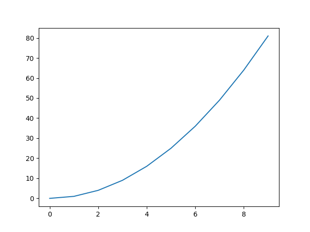

# Finally, a CFFI approach to python interfacing in Common Lisp

Previous Common Lisp attempts: [burgled-batteries3](https://github.com/snmsts/burgled-batteries3)

Non Common Lisp approaches
- see [this reddit thread](https://www.reddit.com/r/lisp/comments/yuipy7/pyffi_use_python_from_racket/) for PyFFI in racket, as well as Gambit Scheme
- [PyCall in Julia](https://github.com/JuliaPy/PyCall.jl)

### Configuration

```lisp
CL-USER> (ql:quickload "py4cl2/cffi-config")
To load "py4cl2/cffi-config":
  Load 1 ASDF system:
    py4cl2/cffi-config
; Loading "py4cl2/cffi-config"
[package py4cl2/cffi-config]
("py4cl2/cffi-config")
```

Set the various configuration parameters in the package `py4cl2/cffi-config` (optionally, first start the lisp process in the virtual environment and then set the configuration parameters):

- `*python-additional-libraries*`
- `*python-additional-libraries-search-path*`
- `*python-include-path*`
- `*python-shared-object-path*`

One can use the `python3-config` or equivalent to find these parameters. (See [../.github/workflows/CI-cffi.yml](../.github/workflows/CI-cffi.yml) For instance, the following lisp command sets the parameters to their appropriate values on the author's PC using a miniconda environment:

```lisp
PY4CL2/CFFI-CONFIG> (setq *python-shared-object-path* #P"/home/user/miniconda3/lib/libpython3.8.so"
                          *python-include-path* #P"/home/user/miniconda3/include/python3.8/"
                          *python-additional-libraries-search-path* #P"/home/user/miniconda3/lib/")
#P"/home/user/miniconda3/lib/"
```

### Status

- [ ] garbage collection touches (partial) [important]
- [x] integers
- [x] strings with SBCL/Unicode
- [x] tuples
- [x] lists
- [x] dicts
- [x] double floats
- [x] function return-values
- [x] function arguments
- [x] output (partially)
- [x] error output (partially)
- [x] python variable values
- [x] numpy arrays to CL arrays
- [ ] numpy arrays to non-CL arrays
- [ ] arbitrary module import (partial) [important]
- [ ] numpy floats
- [ ] lisp callbacks
- [ ] optimizing pythonizers and lispifiers using static-dispatch

... and much more ...

### Why

py4cl2 has gotten the work done for the past few years. But it has the overhead of (i) stream-based inter-process-communication (ii) eval. That's as worse as one could get.

However, when capable, the CFFI approach can be a 50 times faster than py4cl2.

```lisp
CL-USER> (py4cl2/cffi:raw-py "def foo(): return str(1)")
0
CL-USER> (time (dotimes (i 10000)
                 (py4cl2/cffi:pycall "foo")))
Evaluation took:
  0.024 seconds of real time
  0.023645 seconds of total run time (0.022448 user, 0.001197 system)
  100.00% CPU
  52,197,588 processor cycles
  983,040 bytes consed

NIL
CL-USER> (py4cl2:raw-pyexec "def foo(): return str(1)")
; No value
CL-USER> (time (dotimes (i 10000)
                 (py4cl2:pycall "foo")))
Evaluation took:
  1.051 seconds of real time
  0.482699 seconds of total run time (0.304186 user, 0.178513 system)
  45.96% CPU
  20,000 forms interpreted
  2,327,364,348 processor cycles
  5,760,832 bytes consed

NIL
```

Also, passing arrays by reference:

```lisp
PY4CL2/CFFI> (let ((a (aops:rand* 'single-float 10))
                   (b (aops:rand* 'single-float 10)))
               (print a)
               (print b)
               (sb-sys:with-pinned-objects (a b)
                 (pycall "numpy.add" a b :out a))
               a)

#(0.5093733 0.615062 0.5520501 0.4115485 0.35940528 0.0056368113 0.31019592
  0.4214077 0.32522345 0.2879219)
#(0.23799527 0.9120656 0.99672806 0.54783416 0.91948783 0.14750922 0.68077135
  0.75351477 0.17053545 0.6163509)
#(0.7473686 1.5271276 1.5487782 0.95938265 1.2788931 0.15314603 0.9909673
1.1749225 0.4957589 0.9042728)

PY4CL2/CFFI> (let ((a (aops:rand* 'double-float '(3 3))))
               (print a)
               (sb-sys:with-pinned-objects (a)
                 (pycall "numpy.linalg.svd" a)))
#2A((0.8441753387451172d0 0.3109557628631592d0 0.34773027896881104d0)
    (0.3423733711242676d0 0.6038261651992798d0 0.41209208965301514d0)
    (0.5945597887039185d0 0.06366562843322754d0 0.6331008672714233d0))
(#2A((-0.6544319939294636d0 0.16762183299479871d0 -0.7373070503019551d0)
     (-0.49635147614988473d0 -0.8308400431254119d0 0.2516744620798731d0)
     (-0.5703980868177386d0 0.5306672628331492d0 0.6269276503009229d0))
 #(1.4307829399574157d0 0.45313956971575653d0 0.296282569712987d0)
 #2A((-0.7419215134897116d0 -0.37708316610163206d0 -0.5544012569104664d0)
     (0.380805690816161d0 -0.917542287614819d0 0.11446910622779849d0)
     (-0.5518509705193625d0 -0.12619206108679556d0 0.8243397782804759d0)))
```

### A quick and dirty import-module as a function

```lisp
PY4CL2/CFFI> (import-module "matplotlib.pyplot" :as "plt")
T
PY4CL2/CFFI> (pycall "plt.plot"
                     (iota 10)
                     (mapcar (lambda (x) (* x x))
                             (iota 10)))
#(#<PYTHON-OBJECT :type <class 'matplotlib.lines.Line2D'>
  Line2D(_line0)
 {1006670F83}>)
PY4CL2/CFFI> (pycall "plt.show")
#<PYTHON-OBJECT :type <class 'NoneType'>
  None
 {1006672273}>
```

</img>
